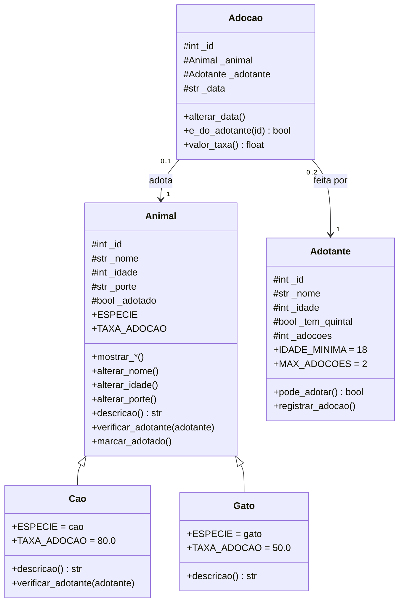

# Adoção de Animais API

Backend da prova de **Programação Orientada a Objetos**, construído em quatro camadas
(padrão MVC) com FastAPI, sobre a estrutura do repositório modelo
[kioferta-python](https://github.com/faustinopsy/kioferta-python).

Um abrigo cadastra animais (cães e gatos) e registra as adoções feitas por adotantes.

> O tema "Adoção de Animais" não está entre os 12 do PDF; o domínio segue o mesmo esqueleto
> (entidade principal + hierarquia + registro que liga as duas), próximo ao Tema 2.

---

## Como rodar

```bash
python -m venv .venv
source .venv/bin/activate       # Linux e macOS
.venv\Scripts\activate          # Windows
pip install -r requirements.txt
uvicorn main:app --reload
```

Abra `http://127.0.0.1:8000/docs`.

## Verificar se está tudo certo

```bash
python verificar.py        # testa models e controllers, sem subir a API
python testar_rotas.py     # testa as rotas (precisa de: pip install httpx)
```

---

## A estrutura

```
adocao-animais/
├── main.py                  liga os módulos à aplicação
├── requirements.txt
├── verificar.py             testa models e controllers
├── testar_rotas.py          testa as rotas
└── app/
    ├── data/                dados provisórios (mock)
    │   ├── animais_mock.py
    │   ├── adotantes_mock.py
    │   └── adocoes_mock.py
    ├── models/              M — classes e regras de negócio
    │   ├── erros.py         ConflitoError (ValueError que vira 409)
    │   ├── animal.py        Animal + Cao + Gato + ESPECIES + carregar_animais()
    │   ├── adotante.py      Adotante + carregar_adotantes()
    │   └── adocao.py        Adocao + carregar_adocoes()
    ├── controllers/         C — casos de uso
    │   ├── animal_controller.py
    │   └── adocao_controller.py
    └── routes/              V — endereços HTTP e códigos de resposta
        ├── animal_routes.py
        └── adocao_routes.py
```

```
main.py  →  routes/  →  controllers/  →  models/  →  data/
```

## Quem decide o quê

| Pergunta | Camada | Como |
| --- | --- | --- |
| A idade do animal é válida (0 a 30)? | model | `raise ValueError` |
| O adotante tem 18 anos ou mais? | model | `raise ValueError` |
| Cão grande exige quintal? | model | `raise ValueError` em `Cao.verificar_adotante` |
| O animal já foi adotado? | model | `raise ConflitoError` |
| O animal 99 existe? | controller | devolve `None` |
| Que código HTTP responder? | routes | `404`, `409`, `422`, `201` |

## Diagrama de classes



- **Herança:** `Cao` e `Gato` herdam de `Animal` e escrevem só a diferença.
- **Polimorfismo:** `descricao()`, `mostrar_taxa()` e `verificar_adotante()` respondem diferente por espécie; o dicionário `ESPECIES` transforma o texto do mock na classe, sem `if` de tipo.
- **Associação:** `Adocao` guarda os objetos `Animal` e `Adotante`, não os ids (ligados em `carregar_adocoes()`).

## Regras de negócio

- Idade do animal entre 0 e 30; nome não vazio; porte pequeno, medio ou grande.
- Adotante com 18 anos ou mais.
- Animal já adotado não pode ser adotado de novo (409).
- Adotante tem no máximo 2 adoções (409).
- Cão de porte grande exige adotante com quintal (422).
- Data da adoção não pode ser vazia (422).
- Taxa de adoção por espécie: constante de classe (cão R$ 80, gato R$ 50).

## As 7 rotas

| Verbo | Endereço | Devolve |
| --- | --- | --- |
| GET | `/api/animais` | todos os animais |
| GET | `/api/animais/{id}` | um animal, ou 404 |
| GET | `/api/animais/disponiveis` | só os não adotados |
| GET | `/api/animais/especie/{especie}` | animais da espécie, ou 404 |
| POST | `/api/adocoes` | registra: 201, 404, 409 ou 422 |
| GET | `/api/adotantes/{id}/adocoes` | histórico do adotante, ou 404 |
| GET | `/api/relatorio/taxas` | total de taxas arrecadadas |

Exemplo: `POST /api/adocoes` com `{"animal_id": 3, "adotante_id": 2}` devolve 201:

```json
{"id": 2, "animal": "Luna", "adotante": "Bruno Lima", "data": "2026-10-05", "taxa": 50.0}
```

Para ver um erro: `{"animal_id": 1, "adotante_id": 2}` devolve 422 (cão grande, adotante sem quintal).

## Saída do verificar.py

```

1. Encapsulamento: o objeto nasce valido
  ok      construtor recusa nome vazio
  ok      construtor recusa idade negativa
  ok      construtor recusa idade acima de 30
  ok      construtor recusa porte invalido
  ok      nao existe alterar_id

2. Encapsulamento: Adotante valida a idade
  ok      construtor recusa menor de 18 anos
  ok      construtor recusa nome vazio

3. Heranca: a hierarquia esta correta
  ok      Cao herda de Animal
  ok      Gato herda de Animal
  ok      Cao NAO reescreve mostrar_nome: herda

4. Heranca: cada filha escreve so a diferenca
  ok      Cao e Gato sobrescrevem descricao
  ok      a constante de classe muda de filha para filha
  ok      descricao() da filha estende a da base com super()

5. Polimorfismo: a mesma chamada, respostas diferentes
  ok      o mock tem pelo menos 5 animais
  ok      o mock virou duas classes diferentes
  ok      cada especie responde a sua taxa
  ok      cada especie responde a sua descricao

6. Associacao: a adocao guarda objetos, nao ids
  ok      mostrar_animal devolve um Animal
  ok      mostrar_adotante devolve um Adotante
  ok      o encadeamento chega ao nome do animal
  ok      a adocao do mock marcou o animal como adotado

7. Regras que dependem da associacao
  ok      cao grande sem quintal e recusado
  ok      animal ja adotado e conflito
  ok      adotante acima do limite e conflito
  ok      data vazia e recusada

8. A conta mora no objeto
  ok      taxa calculada pela propria adocao
  ok      a adocao sabe de quem e

9. Colecoes: filtrar
  ok      tres gatos no mock
  ok      especie inexistente devolve lista vazia
  ok      animal inexistente devolve None
  ok      um animal ja adotado fica de fora dos disponiveis
  ok      adotante inexistente devolve None
  ok      adocao de animal inexistente devolve None

10. Camadas: a model nao conhece o FastAPI
  ok      adocao.py nao importa fastapi
  ok      adotante.py nao importa fastapi
  ok      animal.py nao importa fastapi

11. Camadas: o controller nao devolve codigo HTTP
  ok      adocao_controller.py nao usa HTTPException
  ok      animal_controller.py nao usa HTTPException

12. Projeto: nenhum if de tipo, mocks puros, 4 regras com raise
  ok      nenhum if comparando tipo ou nome de classe
  ok      os mocks nao tem import nem classe
  ok      pelo menos 4 regras com raise nas models
  ok      pelo menos um filtro com compreensao de lista

TUDO CERTO. Agora suba a API e teste no /docs.
```

## Saída do testar_rotas.py

```

ANIMAIS
  ok      GET  /api/animais -> 200
  ok      GET  /api/animais/1 -> 200
  ok      GET  /api/animais/999 -> 404
  ok      GET  /api/animais/abc -> 422
  ok      GET  /api/animais/disponiveis -> 200
  ok      GET  /api/animais/especie/gato -> 200
  ok      GET  /api/animais/especie/cao -> 200
  ok      GET  /api/animais/especie/xyz -> 404

ADOCOES
  ok      POST /api/adocoes ok -> 201
  ok      POST /api/adocoes data informada -> 201
  ok      POST /api/adocoes animal ja adotado -> 409
  ok      POST /api/adocoes acima do limite -> 409
  ok      POST /api/adocoes cao grande sem quintal -> 422
  ok      POST /api/adocoes data vazia -> 422
  ok      POST /api/adocoes animal inexistente -> 404
  ok      POST /api/adocoes adotante inexistente -> 404
  ok      POST /api/adocoes sem campo -> 422
  ok      POST /api/adocoes cao grande com quintal -> 201

HISTORICO E RELATORIO
  ok      GET  /api/adotantes/1/adocoes -> 200
  ok      GET  /api/adotantes/4/adocoes vazio -> 200
  ok      GET  /api/adotantes/999/adocoes -> 404
  ok      GET  /api/relatorio/taxas -> 200

RAIZ E DOCS
  ok      GET  / -> 200
  ok      GET  /docs -> 200
  ok      GET  /openapi.json -> 200

TODAS AS ROTAS OK
```
